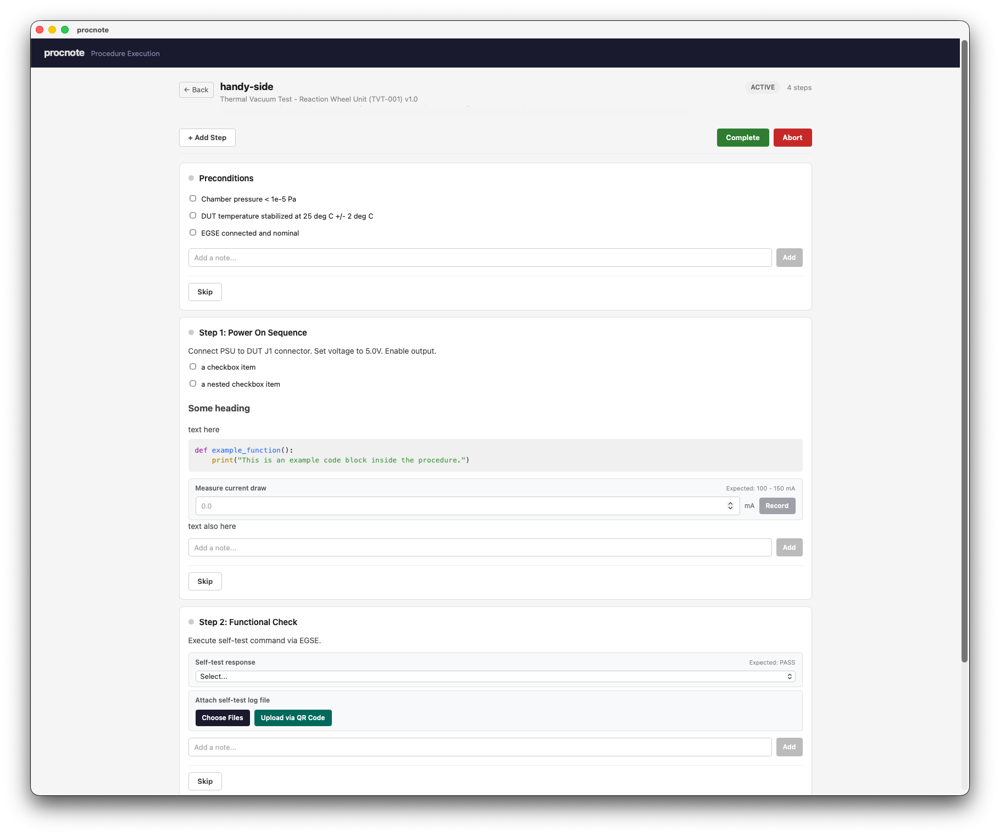

# procnote

> [!WARNING]
> Procnote is in early development. The CLI interface, template grammar, event log schema, and storage layout are all subject to change without notice.

A procedure execution tool for tracking step-by-step procedures with checkboxes, data inputs, attachments, and notes. Built as an event-sourced Tauri 2 desktop app (Rust backend + Svelte 5 frontend).

Procedures are written as Markdown templates with YAML frontmatter. Each execution replays an append-only event log, ensuring crash safety and full auditability.



_The screenshot is based on the example procedure in [`procedures/example-tvt/template.md`](procedures/example-tvt/template.md)._

## Template Syntax

A procedure template is a Markdown file with YAML frontmatter followed by steps defined as `##` headings.

### Frontmatter

```yaml
---
id: TVT-001
title: "Thermal Vacuum Test - Reaction Wheel Unit"
version: "1.0"
author: "Nomura" # optional
equipment: # optional
  - id: CHAMBER-A
    name: "Thermal Vacuum Chamber A"
requirement_traces: # optional
  - REQ-RWU-TEMP-001
---
```

Required fields: `id`, `title`, `version`.

### Steps

Each `##` heading defines a step. Content within a step can include prose, checkboxes, and input blocks in any order. The order in the template is preserved in the UI.

```markdown
## Step 1: Power On Sequence

Connect PSU to DUT J1 connector. Set voltage to 5.0V.
```

### Checkboxes

Use Markdown task list syntax for interactive checkboxes:

```markdown
- [ ] Chamber pressure < 1e-5 Pa
- [ ] DUT temperature stabilized
- [x] Pre-checked item
```

**Constraint:** A list must contain _only_ checkbox items to be recognized as interactive checkboxes. If a list mixes regular bullet items with checkbox items, the entire list is treated as prose (rendered as Markdown text, not interactive checkboxes).

```markdown
<!-- All checkboxes - rendered as interactive checkboxes -->

- [ ] First check
- [ ] Second check

<!-- Mixed list - rendered as prose, NOT interactive checkboxes -->

- A regular bullet point
- [ ] A checkbox item
```

### Input Blocks

Define data-entry fields using a fenced code block with the `inputs` language tag. The block body is YAML:

````markdown
```inputs
- id: current-draw
  label: "Measure current draw"
  type: measurement
  unit: "mA"
  expected:
    min: 100
    max: 150
- id: selftest-result
  label: "Self-test response"
  type: selection
  options: ["PASS", "FAIL", "TIMEOUT"]
  expected: "PASS"
- id: log-file
  label: "Attach log file"
  type: attachment
```
````

Input types:

| Type          | Description                                                  |
| ------------- | ------------------------------------------------------------ |
| `measurement` | Numeric value with optional `unit` and `expected` range      |
| `text`        | Free-form text                                               |
| `selection`   | Dropdown from `options` list, with optional `expected` value |
| `attachment`  | File upload (stored with SHA-256 hash)                       |

### Prose

Any other Markdown content (paragraphs, bullet lists, sub-headings, code blocks, links, etc.) is rendered as-is. Standard Markdown formatting is supported.

### Full Example

````markdown
---
id: TVT-001
title: "Thermal Vacuum Test"
version: "1.0"
---

## Preconditions

- [ ] Chamber pressure < 1e-5 Pa
- [ ] DUT temperature stabilized at 25 deg C

## Step 1: Power On Sequence

Connect PSU to DUT J1 connector. Set voltage to 5.0V. Enable output.

- [ ] Confirm voltage stable

```inputs
- id: current-draw
  label: "Measure current draw"
  type: measurement
  unit: "mA"
  expected:
    min: 100
    max: 150
```

## Postconditions

- [ ] DUT powered off
- [ ] Chamber returned to ambient
````

## Installation

### macOS (Homebrew)

```sh
brew install --cask ut-issl/tap/procnote
```

This installs the app to `/Applications/` and creates a `procnote` CLI command in your PATH.

> [!NOTE]
> The macOS builds are not currently code-signed or notarized. After installing, you need to remove the quarantine attribute:
>
> ```sh
> xattr -cr /Applications/procnote.app
> ```
>
> Without this, macOS will show a "damaged and can't be opened" error.

### Windows / Linux

> [!NOTE]
> Windows and Linux distribution is not well organized yet. Download installers manually from the [Releases page](https://github.com/ut-issl/procnote/releases).
>
> Available artifacts:
>
> - **Windows:** `.msi` and `.exe` installers
> - **Linux:** `.deb` package and `.AppImage`

## Development

Requires [Rust](https://rustup.rs/), [Node.js](https://nodejs.org/), [pnpm](https://pnpm.io/), and [just](https://github.com/casey/just).

```sh
# Start development server
just dev

# Run all checks
just check-all

# Run Rust tests
just test

# Generate TypeScript type bindings from Rust
just generate-types

# Format Rust code
just fmt
```

## Architecture

Three layers with strict dependency direction:

1. **`crates/procnote-core/`** -- Pure Rust domain logic (events, state machine, template parser). No Tauri dependency.
2. **`src-tauri/`** -- Tauri shell. Bridges core to desktop via IPC commands. Owns serialization DTOs and filesystem I/O.
3. **`src/`** -- SvelteKit + Svelte 5 frontend.

Executions are stored as append-only JSONL event logs under `.executions/`.
