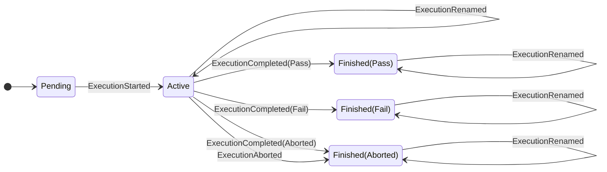
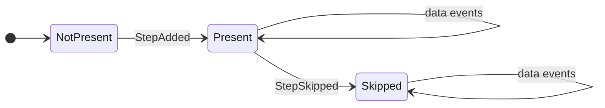

# Executions & Events

Procnote uses **event sourcing** to manage execution state. Every action the operator takes is recorded as an immutable event in an append-only log.

## What is an Execution?

An execution is a recorded instance of running a procedure template. It consists of:

- An **event log** (`events.jsonl`) -- the single source of truth
- A **template snapshot** -- the procedure as it was when the execution started
- **Attachments** -- any files uploaded during the execution

## Event Log

The event log is a JSONL file where each line is a JSON object representing one event. Events are appended sequentially and never modified or deleted.

Each event carries:

- A `type` discriminator (e.g., `StepSkipped`, `CheckboxToggled`)
- An `at` timestamp (ISO 8601)
- An `execution_id`
- Event-specific payload fields

## Event Types

### Lifecycle Events

| Event                | Description                                                  |
| -------------------- | ------------------------------------------------------------ |
| `ExecutionStarted`   | Marks execution start; captures procedure ID, title, version |
| `ExecutionCompleted` | Execution finished with pass or fail status                  |
| `ExecutionAborted`   | Execution stopped early with a reason                        |

### Step Events

| Event         | Description                                             |
| ------------- | ------------------------------------------------------- |
| `StepAdded`   | A new step was added (from template or dynamically)     |
| `StepSkipped` | Step intentionally skipped with a reason, if applicable |

### Data Capture Events

| Event             | Description                                    |
| ----------------- | ---------------------------------------------- |
| `CheckboxToggled` | Checkbox checked or unchecked                  |
| `InputRecorded`   | Measurement, text, or selection value recorded |
| `AttachmentAdded` | File attached (stored with SHA-256 hash)       |
| `NoteAdded`       | Note added to a step or to the execution       |

### Metadata & Audit Events

| Event              | Description                                          |
| ------------------ | ---------------------------------------------------- |
| `LogMeta`          | First event; records schema version and tool version |
| `ExecutionRenamed` | Execution given a human-readable name                |
| `EventReverted`    | Marks a previous event as reverted                   |

## State Machine

The current execution state is the combination of one **execution lifecycle** and step presence/skip state for each UI step. Events are applied by replaying the log in order; `LogMeta` and `EventReverted` are replay metadata rather than direct state transitions.

### Execution Lifecycle

Lifecycle rules:

| Event                | Valid when             | Effect                                                     |
| -------------------- | ---------------------- | ---------------------------------------------------------- |
| `ExecutionStarted`   | execution is `Pending` | execution becomes `Active`; procedure metadata is captured |
| `ExecutionCompleted` | execution is `Active`  | execution becomes `Finished(status)`                       |
| `ExecutionAborted`   | execution is `Active`  | execution becomes `Finished(Aborted)`                      |
| `ExecutionRenamed`   | execution has started  | name is updated; allowed after finish                      |
| step and data events | execution is `Active`  | step collection, skip status, or captured data is updated  |

### Step State

Steps are primarily UI/grouping units for procedure content and captured data. Procnote does not model “starting” or “completing” each step; the current/selected step is UI state, not event-sourced domain state.

Here, **data events** means `CheckboxToggled`, `InputRecorded`, `AttachmentAdded`, and step-scoped `NoteAdded`. The implementation requires the execution to be active and the step to exist.

Step state rules:

| Event         | Valid when                                 | Effect                                                          |
| ------------- | ------------------------------------------ | --------------------------------------------------------------- |
| `StepAdded`   | execution is `Active`, `step_id` is unique | creates a `Present` step and inserts it into step order         |
| `StepSkipped` | execution is `Active`, step is `Present`   | step becomes `Skipped`                                          |
| data events   | execution is `Active`, step exists         | captured data or notes are updated without changing step status |

!!! info "Revert validation"

    Reverting an event is not modeled as a direct reverse transition. Procnote appends an `EventReverted` marker, then rebuilds state while skipping the reverted event. Before appending the marker, it performs a **trial replay** to verify that the resulting state is valid.

## State Reconstruction

Execution state is never stored directly. It is always **reconstructed by replaying the event log**:

1. **First pass:** Collect all reverted event indices from `EventReverted` markers.
2. **Second pass:** Apply each non-reverted event to build the current state.

This means the app can crash at any point and recover perfectly by re-reading the log on restart.

## Reverting Events

Events are classified into three categories by revertibility:

| Category           | Events                                                                   | Can revert? |
| ------------------ | ------------------------------------------------------------------------ | ----------- |
| **Revertible**     | Checkboxes, inputs, notes, step skip, execution completion/abort, rename | Yes         |
| **Not revertible** | ExecutionStarted, StepAdded, LogMeta                                     | No          |
| **Revert marker**  | EventReverted (cannot itself be reverted)                                | No          |

When an event is reverted:

1. The system validates the event is revertible and not already reverted.
2. A trial replay is performed to ensure the resulting state is valid.
3. An `EventReverted` marker is appended with the target event index and a reason.
4. The original event remains in the log -- nothing is deleted.

This preserves a complete audit trail: you can see what was done, what was undone, and why.
