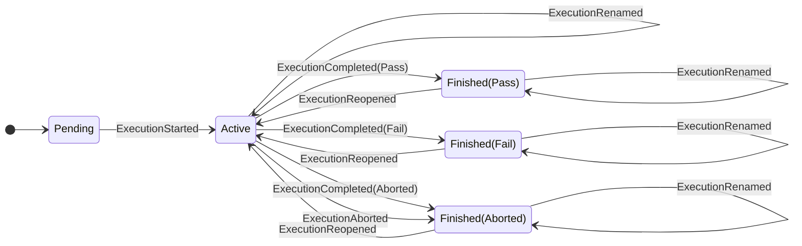
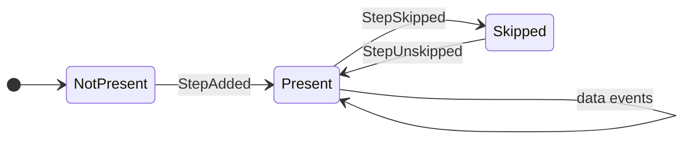
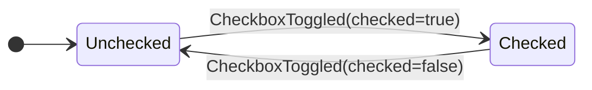
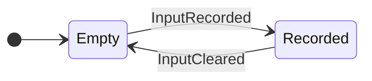
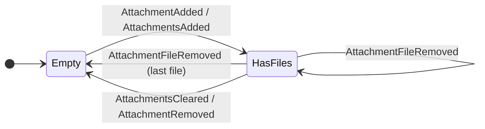
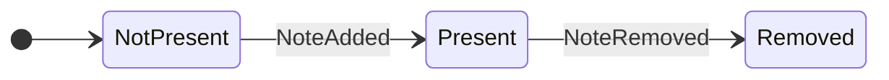

# Executions & Events

Procnote uses **event sourcing** to manage execution state. Every action the operator takes is recorded as an immutable event in an append-only log.

## What is an Execution?

An execution is a recorded instance of running a procedure template. It consists of:

- An **event log** (`events.jsonl`) -- the single source of truth
- A **template snapshot** -- the procedure as it was when the execution started
- **Attachments** -- any files uploaded during the execution

## Event Log

The event log is a JSONL file where each line is a JSON object representing one event. Events are appended sequentially and never modified or deleted.

Each event carries:

- A `type` discriminator (e.g., `StepSkipped`, `CheckboxToggled`)
- An `at` timestamp (ISO 8601)
- An `execution_id`
- Event-specific payload fields

## Event Types

### Lifecycle Events

| Event                | Description                                                  |
| -------------------- | ------------------------------------------------------------ |
| `ExecutionStarted`   | Marks execution start; captures procedure ID, title, version |
| `ExecutionCompleted` | Execution finished with pass, fail, or aborted status        |
| `ExecutionAborted`   | Execution stopped early with a reason                        |
| `ExecutionReopened`  | Finished execution reopened for further work                 |

### Step Events

| Event           | Description                                             |
| --------------- | ------------------------------------------------------- |
| `StepAdded`     | A new step was added (from template or dynamically)     |
| `StepSkipped`   | Step intentionally skipped with a reason, if applicable |
| `StepUnskipped` | A previously skipped step was made active again         |

### Data Capture Events

| Event               | Description                                               |
| ------------------- | --------------------------------------------------------- |
| `CheckboxToggled`   | Checkbox checked or unchecked                             |
| `InputRecorded`     | Measurement, text, or selection value recorded            |
| `InputCleared`      | Previously recorded input value cleared with a reason     |
| `AttachmentAdded`   | File attached (stored with SHA-256 hash)                  |
| `AttachmentRemoved` | Previously attached file removed from the execution state |
| `NoteAdded`         | Note added to a step or to the execution                  |
| `NoteRemoved`       | Previously added note removed from the execution state    |

### Metadata & Audit Events

| Event              | Description                                          |
| ------------------ | ---------------------------------------------------- |
| `LogMeta`          | First event; records schema version and tool version |
| `ExecutionRenamed` | Execution given a human-readable name                |

## State Machine

The current execution state is the combination of one **execution lifecycle**, step presence/skip state for each UI step, and captured data state for each checkbox, input, attachment, and note. Events are applied by replaying the log in order; `LogMeta` is replay metadata rather than a direct state transition.

### Execution Lifecycle

Lifecycle rules:

!!! note "Aborted completion status"

    `ExecutionCompleted(Aborted)` is representable in the event model because `ExecutionCompleted` carries a general completion status. In the current UI, aborting an execution is recorded as `ExecutionAborted` so that an operator-provided reason is preserved.

| Event                | Valid when              | Effect                                                     |
| -------------------- | ----------------------- | ---------------------------------------------------------- |
| `ExecutionStarted`   | execution is `Pending`  | execution becomes `Active`; procedure metadata is captured |
| `ExecutionCompleted` | execution is `Active`   | execution becomes `Finished(status)`                       |
| `ExecutionAborted`   | execution is `Active`   | execution becomes `Finished(Aborted)`                      |
| `ExecutionRenamed`   | execution has started   | name is updated; allowed after finish                      |
| `ExecutionReopened`  | execution is `Finished` | execution becomes `Active` again                           |
| step and data events | execution is `Active`   | step collection, skip status, or captured data is updated  |

### Step State

Steps are primarily UI/grouping units for procedure content and captured data. Procnote does not model “starting” or “completing” each step; the current/selected step is UI state, not event-sourced domain state.

Here, **data events** means checkbox, input, attachment, and step-scoped note events. The implementation requires the execution to be active and the step to be present, not skipped.

Step state rules:

| Event           | Valid when                                                        | Effect                                                          |
| --------------- | ----------------------------------------------------------------- | --------------------------------------------------------------- |
| `StepAdded`     | execution is `Active`, `step_id` is unique                        | creates a `Present` step and inserts it into step order         |
| `StepSkipped`   | execution is `Active`, step is `Present` and has no captured data | step becomes `Skipped`                                          |
| `StepUnskipped` | execution is `Active`, step is `Skipped`                          | step becomes `Present`                                          |
| data events     | execution is `Active`, step is `Present`                          | captured data or notes are updated without changing step status |

### Data State

Data state is modeled per data item. Data events require the execution to be active. Step-scoped data also requires the referenced step to be present, not skipped; global notes are scoped to the execution instead.

#### Checkbox State

#### Input State

#### Attachment State

Attachment inputs can contain zero or more files. A single operator action can add one file or a batch of files.

#### Note State

Data state rules:

| Event                   | Valid when                                                                      | Effect                                                 |
| ----------------------- | ------------------------------------------------------------------------------- | ------------------------------------------------------ |
| `CheckboxToggled`       | execution is `Active`, checkbox exists in a present step                        | checkbox state becomes the event's `checked` value     |
| `InputRecorded`         | execution is `Active`, input is `Empty` in a present step                       | input becomes `Recorded` with the captured value       |
| `InputCleared`          | execution is `Active`, input is `Recorded` in a present step                    | input becomes `Empty`                                  |
| `AttachmentAdded`       | execution is `Active` and target step is present                                | one attachment file is added                           |
| `AttachmentsAdded`      | execution is `Active`, target step is present, and batch is non-empty           | one or more attachment files are added                 |
| `AttachmentFileRemoved` | execution is `Active`, target step is present, and file exists                  | one attachment file is removed                         |
| `AttachmentsCleared`    | execution is `Active`, target step is present, and input has attachments        | all files for the attachment input are removed         |
| `AttachmentRemoved`     | legacy event: execution is `Active` and attachment input has attachments        | all files for the attachment input are removed         |
| `NoteAdded`             | execution is `Active`, note ID is unique; target step is present if step-scoped | note becomes `Present`                                 |
| `NoteRemoved`           | execution is `Active`, note is `Present`; target step is present if step-scoped | note becomes `Removed` and is hidden from current view |

Together, the lifecycle, step, and data diagrams cover all state-affecting event types. `LogMeta` is the only event type that is purely replay metadata.

!!! info "Reversal validation"

    Reversing a user-visible action is modeled as another user-visible action, not as generic log editing. For example, clearing an input, unskipping a step, and reopening an execution are distinct typed events with their own validation rules.

## State Reconstruction

Execution state is never stored directly. It is always **reconstructed by replaying the event log** in order. Every event is applied; metadata events such as `LogMeta` are ignored by the state machine.

This means the app can crash at any point and recover perfectly by re-reading the log on restart.

## Reversing Actions

Procnote does not model reversal as a generic “undo event” that points at a previous log entry. Operators do not edit the event log; they take another domain action in the UI. The event log records that action explicitly.

| User intent                | Event recorded          | Valid when                                   |
| -------------------------- | ----------------------- | -------------------------------------------- |
| Clear a recorded input     | `InputCleared`          | the input currently has a value              |
| Remove one attachment file | `AttachmentFileRemoved` | the attachment file currently exists         |
| Clear all attachments      | `AttachmentsCleared`    | the attachment input currently has files     |
| Remove a note              | `NoteRemoved`           | the note currently exists                    |
| Unskip a step              | `StepUnskipped`         | the step is currently skipped                |
| Reopen an execution        | `ExecutionReopened`     | the execution is currently finished          |
| Rename an execution        | `ExecutionRenamed`      | the execution has started                    |
| Toggle a checkbox back     | `CheckboxToggled`       | the checkbox exists in a present active step |

This keeps replay simple: apply every event in order.

It also keeps reversibility type-checked. Reversible concepts have explicit event variants and explicit state-machine transitions. Adding a new event type requires deciding, in the event and state-machine code, whether it is irreversible or what typed domain action reverses its effect.

The original event remains in the log and the reversing action is appended. This preserves a complete audit trail: you can see what was done, what was later changed, and the reason where the UI captures one.
