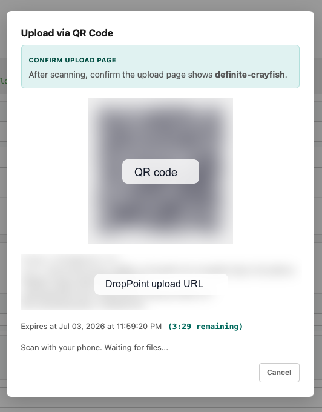

# DropPoint Integration

Procnote can use [DropPoint](https://github.com/shunichironomura/drop-point) to receive attachment files from another device, such as a phone, through a QR-code upload flow.



## What DropPoint Is

DropPoint is a temporary encrypted file handoff relay. Procnote creates a short-lived drop point, shows a QR code, and later imports one encrypted upload as local Procnote attachments.

DropPoint is **not** built into Procnote and is **not** a permanent storage service. You need to set up and operate your own DropPoint instance before enabling this integration. The DropPoint relay stores ciphertext only; Procnote decrypts the upload locally and then stores the plaintext files in the execution's attachment directory.

For DropPoint setup and deployment details, see the DropPoint repository:

<https://github.com/shunichironomura/drop-point>

## Configure a DropPoint Instance

Follow the DropPoint documentation to deploy a reachable DropPoint server and generate an API token. At minimum, your DropPoint instance needs:

- an externally visible `base_url` for sender browsers;
- an API token configured on the DropPoint server;
- HTTPS for non-local deployments, so browser encryption APIs are available;
- request body limits and upload timeouts large enough for the files you expect users to upload.

For local development, DropPoint can run on `http://localhost`. Procnote rejects non-HTTPS DropPoint URLs except loopback HTTP URLs.

## Enable DropPoint in Procnote

Set these environment variables before starting Procnote:

| Variable                         | Required | Description                                                                                                                  |
| -------------------------------- | -------- | ---------------------------------------------------------------------------------------------------------------------------- |
| `PROCNOTE_DROPPOINT_URL`         | Yes      | Root origin of your DropPoint instance, for example `https://drop.example.com`. Must not include a path prefix, query, fragment, or user info. |
| `PROCNOTE_DROPPOINT_API_TOKEN`   | Yes      | Plaintext DropPoint API token used by Procnote to create receiver-side drop points.                                          |
| `PROCNOTE_DROPPOINT_TTL_SECONDS` | No       | Requested lifetime, in seconds, for each upload session. Must be a positive integer.                                         |
| `PROCNOTE_DROPPOINT_MAX_BYTES`   | No       | Requested maximum encrypted upload size, in bytes. Must be a positive integer and within the server's configured limit.      |

Example:

```bash
PROCNOTE_DROPPOINT_URL=https://drop.example.com \
PROCNOTE_DROPPOINT_API_TOKEN='your-drop-point-token' \
PROCNOTE_DROPPOINT_TTL_SECONDS=600 \
PROCNOTE_DROPPOINT_MAX_BYTES=52428800 \
procnote /path/to/my-workspace
```

Both required variables must be set to create new DropPoint sessions. If only one is set, Procnote disables new session creation and logs a configuration warning. A previously persisted receiver session can still resume pickup or close from its owner-only private state without retaining the API creation token.

## Use DropPoint During an Execution

When DropPoint is configured, attachment inputs show an **Upload via QR Code** button.

1. Click **Upload via QR Code** on an attachment input.
2. Ask the sender to scan the QR code with their device.
3. Confirm that the sender's upload page shows the same human-readable drop name shown in Procnote.
4. Wait while the sender selects and uploads files.
5. Procnote authenticates the complete encrypted bundle, installs all files atomically as local attachments, durably records them in the execution log, and only then closes the remote drop point.

If pickup, local installation, execution-log recording, or remote close fails, Procnote retains resumable private session state and leaves recoverable remote ciphertext available. Use **Retry** (or reopen the same attachment upload after restarting Procnote) to continue without reinstalling an already verified bundle. A relay-reported `expired`, `failed`, or prematurely `closed` state is terminal.

Recovered files are published together beneath the execution's `attachments/bundle-dp_…/` directory. The directory includes an owner-only `.droppoint-receipt.json` identity receipt used only for crash recovery and conflict detection; the receipt is not shown as an attachment. Procnote never merges into or overwrites a different pre-existing bundle directory.

Pickup capabilities and recipient private keys are stored atomically with owner-only access in the operating system's application-local data directory, outside the git-friendly procedure workspace. Procnote removes those secrets from private state only after remote close succeeds or a terminal remote outcome has been durably recorded.
